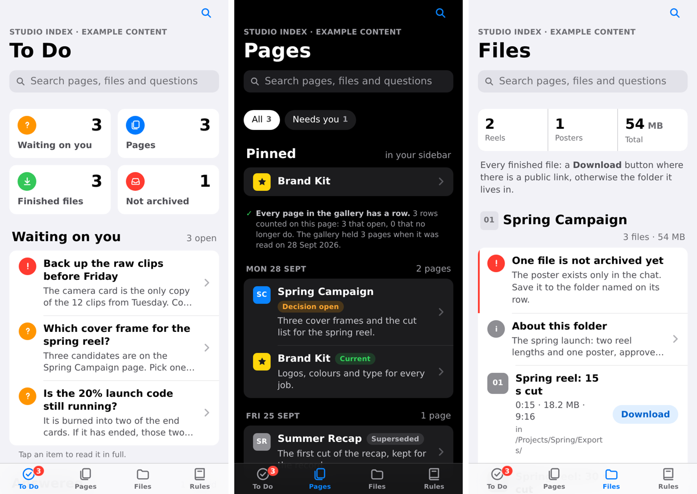

# iPhone index layout

Omarie, 28 Sept 2026, on the rebuilt Download Everything index: "save this apple layout it looks so nice".

This is the layout for any page people use to find things: an index, a directory, a deliverables list, a to-do board.
It reads like an iPhone app, with Apple's system font, iOS colours and a tab bar. It was first built for the Download
Everything master index, and this folder holds its design with sample content only. Real files, links and names
never go in this public repo.



## Files

| File | What it is |
|---|---|
| `style.css` | The whole design: tokens for light and dark, the type scale and every component |
| `app.js` | Tabs, one search across every tab, filter chips, and counts taken from the page itself |
| `example_page.py` | Builds `example.html` from sample rows. Copy it to start a new page and swap in real rows |
| `example.html` | The sample page, self-contained (CSS and JS inlined), ready to publish as an artifact |
| `qa.js` | The layout check to run before publishing (below) |

## The design

**Type.** `-apple-system` first, so iPhones and Macs get SF Pro, with Inter from Google Fonts everywhere else. The
sizes follow iOS: 34 px large title, 22 px section headers, 17 px row titles, 15 px secondary text, 13 px footnotes.
Digits are tabular wherever they line up.

**Colour.** iOS system colours, defined as tokens on `:root` and redefined for dark mode. The grouped background is
`#F2F2F7` (black in dark), cells are white (`#1C1C1E` in dark), and the tint is `#007AFF` (`#0A84FF` in dark). Status
text uses darker variants of the system colours in light mode so small text stays above 4.5:1.

**Structure.**

- A small overline with the page name and date, then a large title that changes with the tab. The nav bar turns solid
  and shows a small title once the large one scrolls away.
- One search field that looks through every tab at once. It opens any row whose hidden text matches and shows
  "No results" when nothing does. `/` focuses it.
- A tab bar at the bottom with four tabs at most and a red badge counted from the list, never typed by hand.
- Counter tiles like the Reminders app, which jump to what they count.
- Inset grouped lists: rounded groups of rows with hairline separators, a coloured icon tile or glyph circle on the
  left and a chevron on the right.
- Rows with long text are native `<details>`. A row shows its title and a two-line preview, and a tap opens the full
  text, so nothing is cut off and nothing is lost.
- Status pills (Current, Decision open, Superseded and so on) on tinted backgrounds, and callout rows with a coloured
  edge for anything urgent.
- File rows with an App Store style **Download** capsule where there is a link, or a grey chip naming where the file
  lives (Dropbox, In chat).
- Filter chips and jump chips that scroll sideways, a Pinned group at the top of a list, and a counted check that
  every page in a gallery has a row.

**Spacing.** A 16 px side gutter at every width, a 700 px reading column on wide screens, tap targets of 44 px or
more, and safe-area insets on the nav bar, the tab bar and the page, so nothing sits under the iPhone's notch or home
bar.

## Before publishing

```bash
python3 example_page.py                  # or your own copy of it
node qa.js example.html                  # needs Node with Playwright
```

`qa.js` opens every tab at 390 px in light and dark mode, at 360 px and at 1280 px, with every row expanded. It fails
on sideways scrolling, clipped text, overlapping items in a row, anything off screen, a footer hidden under the tab
bar, or a script error, and it saves a screenshot of each tab. Publish only when it prints `all clear`.

## Where it is used

- **Download Everything**, the master index (rebuilt in this layout on 28 Sept 2026).
