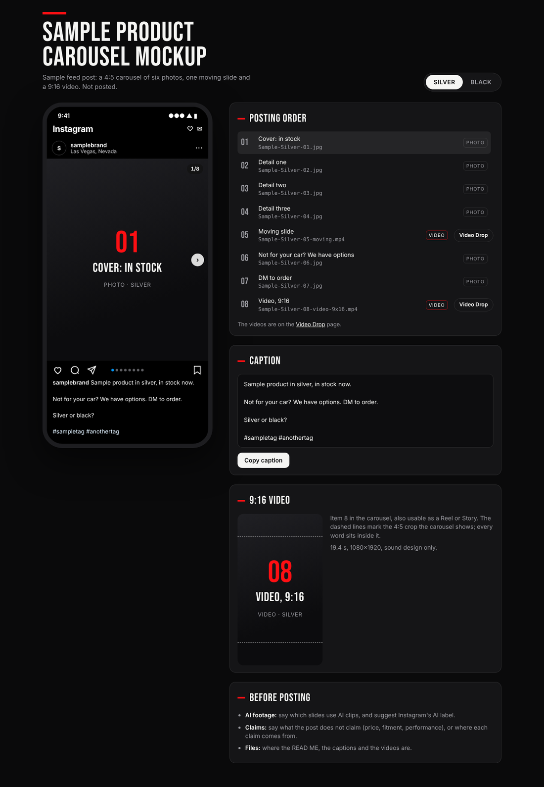

# Post mockup

Omarie, 10 Oct 2026, on the Formula Dynamics Opus exhaust tips carousel mockup: "this is a great model and way to
show what it would look like save this".

This is the page for showing a social post before it goes out. The post sits in an Instagram phone frame, so it can
be swiped the way it will be seen. Beside it is everything needed to post it: one carousel per version, the posting
order with a Save button per photo, the caption, the 9:16 cut and the notes to read first. This folder holds the
design with sample content only. Real files, links and names never go in this public repo.



## Files

| File | What it is |
|---|---|
| `template.html` | The whole page. Edit its `POST` block and brand tokens to make a new one; as it stands it draws labelled placeholders |
| `qa.js` | The check to run before publishing (below) |
| `preview.png` | The sample page at 1280 px |

## When to use it

Use it whenever a job ends in a post Omarie approves and posts himself: a carousel, a single feed post, or a set
with a Reel. It presents the work; it doesn't style it. Ask which style the post itself takes first (CLAUDE.md, rule
1). It was first used for the FD Opus exhaust tips carousel in tan and black, on 10 Oct 2026.

## The design

**Phone.** At most 400 px wide, with Instagram's chrome:

- the status bar;
- a header with the avatar, handle and location;
- a snap-scrolling 4:5 track (or 1:1) with a `1/8` counter, previous and next buttons and the blue dots;
- the action row;
- the caption, with the handle in bold and the hashtags tinted.

Videos play muted, each with a Sound button.

**Posting kit.**

- **Version switch.** One carousel per colour or finish, hidden when there is only one. The choice is remembered
  per viewer.
- **Posting order.** Each item has its number, its label, the exact file name to post and a Photo or Video tag. Tapping
  a row jumps the phone to that slide.
- **Saving.** Photos get a **Save** button that uses the `downloads` capability. It hands the viewer the file under
  its posting name, and it is hidden where the capability isn't available. Videos link to the Video Drop page,
  where they are delivered.
- **Caption.** A Copy button; where the clipboard is refused, the caption is selected for copying instead.
- **9:16 video.** Dashed lines mark the 4:5 crop the carousel shows (1350 of the 1920 px, starting 285 px down), so
  it's easy to see that every word sits inside it.
- **Before posting.** Notes on AI footage, claims and where the files are.

**Look.** One deliberate dark look: Instagram's dark mode on the brand's ground. Headlines use the brand's display
face and the interface uses Apple's system font. The brand's accent appears only on the rule above the title and
on each section's marker. The gutter is 20 px, and the two columns stack into one under 860 px.

## Making a new one

1. Copy `template.html` into the scratchpad as `index.html`.
2. Fill in the `POST` block:
   - the title, subline, handle, location and avatar;
   - `variants`: each version's `id`, which is also its folder name, plus its label and caption;
   - `items`: each slide's file, its posting name (`{V}` becomes the version label) and its label, with `v: true` on
     videos;
   - `videoLink`: the Video Drop page;
   - `reel`: the 9:16 item and the lines beside it;
   - `notes`.

   Set `demo: false`. Every caption and note must trace to a source, as in any delivery.
3. Set the brand tokens at the top of the style (`--ground`, `--panel`, `--accent`, `--display`) and the Google Fonts
   link, in the workstream's own brand. The template carries Formula Dynamics': FD red `#FE0F13` and Bebas Neue on
   black. Other workstreams take theirs from their brand spec. Two brands never share a page.
4. Put the files next to the page as `{version id}/{file}`, plus the avatar (for FD, the brand kit's
   `fd-icon-white.png`).
5. Run the check, below.
6. Publish with the Artifact tool:
   - `file_path`: the page;
   - `files`: each `{id}/{file}` and the avatar;
   - `capabilities: {downloads: true}`;
   - `icon: "phone"`.

   The regret gate asks before publishing.

## Before publishing

```bash
node qa.js index.html                    # needs Node with Playwright
```

`qa.js` wraps the page in the artifact host's skeleton. It opens every version at 390 px, 360 px and 1280 px and
fails on any of these:

- the page scrolling sideways;
- anything clipped or off screen outside the carousel track;
- a posting order without one row per item;
- an empty caption;
- a counter that doesn't read `1/N`, then `2/N` after Next;
- a script error;
- unless `demo` is on, any file the page points at that isn't next to it.

It saves a screenshot of each version at each size. Publish only when it prints `all clear`.

## Where it is used

- **FD Opus exhaust tips carousel**, tan and black (10 Oct 2026).
