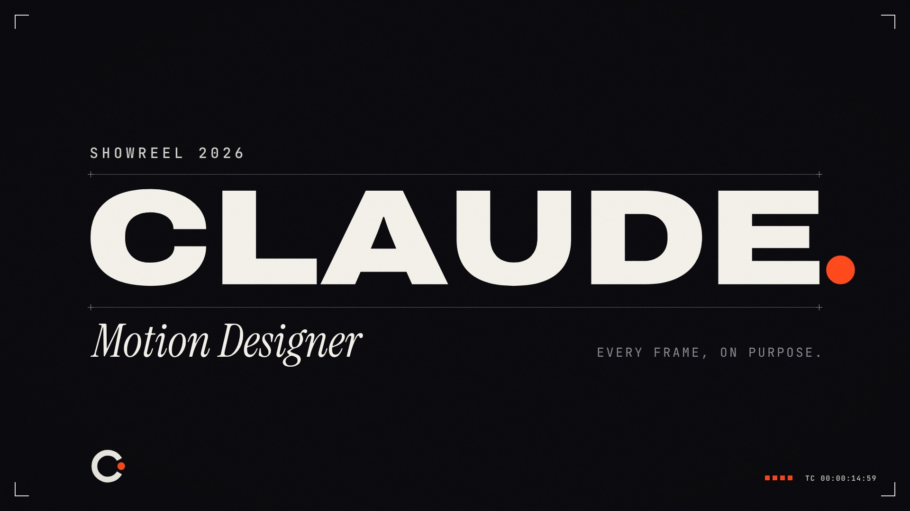
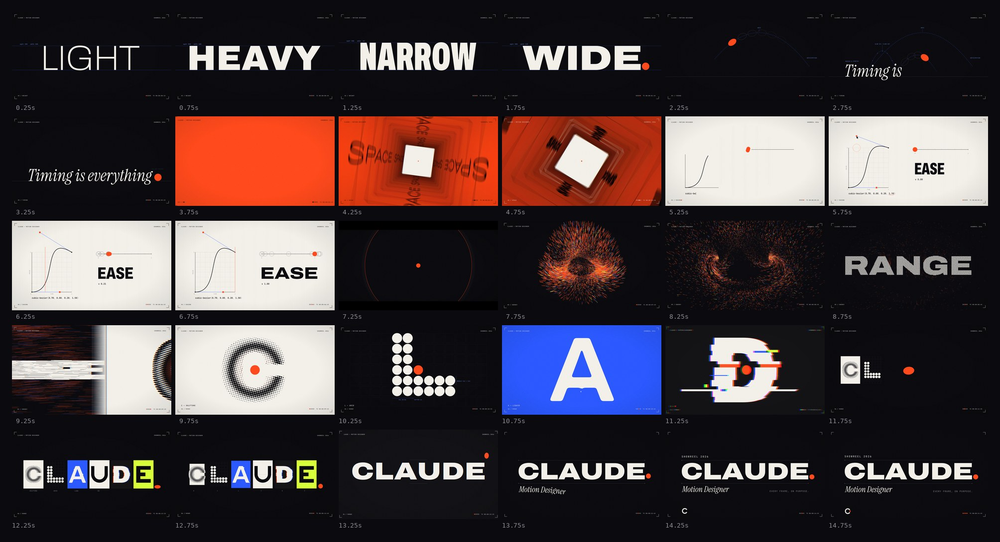

# Showreel 2026 — Claude, Motion Designer

A 15-second, 1080p60 motion-graphics showreel that is **written entirely in code**: DOM, CSS, SVG and Canvas 2D,
rendered frame by frame in headless Chromium and scored with a procedurally synthesized soundtrack locked to a
128 BPM grid. There is no footage, stock art or sample library. Every pixel and every sample is generated.

[](dist/showreel.mp4)

- **Watch:** [`dist/showreel.mp4`](dist/showreel.mp4) (15 s, 1080p60, sound on)
- **Play it live in a browser:** serve this folder and open `index.html?play` (click to start, sound on)
- **Storyboard:** [`STORYBOARD.md`](STORYBOARD.md) is the as-built spec. Its machine-readable twin,
  [`storyboard.json`](storyboard.json), feeds `tools/scaffold.mjs` and `audio/qa.py --make-cues`.



## What's in the reel

*FULL STOP.* One Signal-orange full stop is born at the end of a word, travels through every discipline of motion
design, and lands as the period after CLAUDE. It is the only object that crosses cuts, and every handoff is a held,
pixel-exact rest pose.

| Scene | Time (s) | Technique showcased |
|---|---|---|
| s00 The Frame | 0 → 15 | Persistent Swiss HUD: crop marks, odometer chapter index, frame-exact timecode, a beat meter that lights on every kick; colour switches on exact frames, split at hard ground edges |
| s01 Axis | 0 → 1.875 | Variable-font weight and width on the beat (LIGHT / HEAVY / NARROW / WIDE), per-letter slot swaps, squash and stretch on type, blueprint construction lines, the dot is born |
| s02 Timing | 1.875 → 3.75 | Character animation with the 12 principles: bouncing dot, onion skins, spacing chart, serif sentence stamped into existence, exponential dive into the dot |
| s03 Space | 3.75 → 5.156 | A type corridor: a CSS-3D camera evaluated analytically on Canvas 2D, hinge unfold, spring rolls, dolly and log-scale rush, vector lettering, real 180° motion blur |
| s04 Easing | 5.156 → 7.031 | A live cubic-bezier graph editor: cursor micro-interactions, a handle dragged out of the box, a spacing chart and a real overshoot driving a width axis |
| s05 Energy | 7.031 → 9.375 | A one-beat held breath, then 12,000 simulated particles (curl noise, twin vortices) snapping into a dot-matrix RANGE; whip-pan out |
| s06 Range I | 9.141 → 11.25 | Centre-locked montage: C halftone, L modular grid, A metaball liquid with a drip-through, U data-viz chart |
| s07 Range II | 11.25 → 13.125 | D glitch / RGB split, E shape layers, a specimen row that reveals the montage spelled CLAUDE, the width-62 squeeze |
| s08 Full Stop | 13.125 → 15 | Logotype release from width 62 to 125, the dot's smear-arc-squash landing as the hanging period, Swiss end-card lockup, "C." monogram tick |

## Outputs (`dist/`)

| File | What |
|---|---|
| `dist/showreel.mp4` | The web cut: H.264 High@4.2 1080p60 (BT.709, yuv420p, CRF 21, ≈14 MB) with 320 kbps AAC 48 kHz audio |
| `dist/showreel-master.mp4` | The high-quality master (CRF 16, ≈40 MB) from `node tools/render.mjs --master`; git-ignored, delivered separately |
| `dist/soundtrack.wav` | The score: 48 kHz, 24-bit stereo, exactly 720000 frames, −14 LUFS integrated, true peak ≤ −1 dBTP |
| `dist/poster.jpg` | Poster still: the final frame (f899, the locked end card), 1920×1080 |
| `dist/contact-sheet.jpg` | Contact sheet of the reel: 30 frames every 0.5 s (0.25 → 14.75 s), 6 × 5 grid, time-labelled |

## Build it

Requirements: Node 18+, Playwright with a Chromium build, Python 3 with `numpy` (and Pillow for `audio/qa.py`),
and an ffmpeg that has libx264 (`pip install imageio-ffmpeg numpy pillow` provides the Python pieces).

The picture declares its own sounds, so export the cues **before** synthesizing, and synthesize before rendering
(the render muxes whatever `dist/soundtrack.wav` exists):

```bash
cd showreel
node tools/cues.mjs                    # 1. picture -> audio/cues.json (scene windows, R.cue FX cues, R.sfx events)
python3 audio/synth.py --stems         # 2. audio/cues.json -> dist/soundtrack.wav (+ per-bus stems in .cache/stems/)
python3 audio/qa.py                    #    audio QA on the stems: loudness, clicks, kick grid, picture-lock table
node tools/render.mjs                  # 3. -> dist/showreel.mp4 (1080p60 web cut, muxes dist/soundtrack.wav)
node tools/render.mjs --master --reuse # optional: CRF 16 master from the same frames (add --keep to the first run)

node tools/render.mjs --preview        # fast 30 fps check -> .cache/preview.mp4
node tools/stills.mjs --scene s03 --count 12 --sheet   # QA stills + labelled contact sheet
```

## How it works

```
index.html            stage, @font-face, interactive player (?play)
src/engine.js         deterministic runtime: timing grid, easing, springs, keyframes, noise, DOM/SVG/canvas
                      helpers, point sets for morphs/particles, pseudo-3D, global post-FX, scene registry
src/scenes/*.js       one module per scene; manifest.js lists the load order
storyboard.json       machine-readable storyboard: scene windows, beats, FX cues, sound events, HUD schedule
tools/scaffold.mjs    manifest + placeholder scenes from storyboard.json (never overwrites a scene file)
tools/cues.mjs        exports scene windows, FX cues and sound events -> audio/cues.json
tools/render.mjs      Chromium frame capture (parallel pages, contiguous chunks) -> ffmpeg (BT.709, yuv420p)
tools/stills.mjs      stills + contact sheets for visual QA
tools/determinism.mjs checks a scene renders identically in order and shuffled
audio/synth.py        numpy soundtrack: drums, sub, stabs, risers, impacts; picture-synced from cues.json
audio/qa.py           soundtrack QA: integrity, loudness, clicks, kick grid, picture-lock table, micro-sfx levels
fonts/                Archivo (variable wght+wdth), Instrument Serif, JetBrains Mono (all SIL OFL 1.1)
```

Everything is a pure function of time. The renderer seeks to `t = frame / 60`, calls `R.render(t)` and screenshots the
page, so frames can be rendered out of order and in parallel, and every render is bit-for-bit repeatable.

### Soundtrack

`audio/synth.py` renders the arrangement (the `SONG` bar table, 128 BPM, F minor) and plays every picture `R.sfx`
event on the SFX bus at its exact sample; arrangement hits of the same type step aside when the picture declares
its own. Two per-event tables sit in its arrangement section, both matched on `(type, t)` within 1 ms:

- `PICTURE_PAN`: pan direction for picture whooshes that do not pass their own `pan`. A whoosh's default pan
  follows its `dir` (up = left → right, down = right → left); the s02 leap is declared `dir: 'up'` but pans
  right → left with the dot.
- `EVENT_MIX`: per-event mix overrides. `gain` (dB after the micro-sfx ride, so it may exceed its range), `duck`
  (how far the music dips under the event) and `low_shelf` (Hz, dB) on that event's own buffer. It lifts the s08
  period-lands pop over the final hit and trims the sub of the bar-5 drop layers.

`audio/qa.py` reads the stems from `python3 audio/synth.py --stems` and prints format, loudness and click checks,
the kick grid, low-end balance, the storyboard's picture-lock table (expected vs measured) and each micro-sfx level
against the bed; it writes waveform and spectrogram PNGs to `.cache/audio-qa/`. To score against the storyboard
before the scenes exist: `python3 audio/qa.py --make-cues` writes `.cache/storyboard-cues.json`, then
`python3 audio/synth.py --cues .cache/storyboard-cues.json --stems`.

---

## Scene builder guide

### Contract

```js
R.scene({
  id: 's03-space',             // must match the storyboard id
  start: 3.75, end: 5.15625,   // global seconds, window is [start, end). Snap to the grid: R.pos(bar, beat, 16th)
  z: 30,                       // stacking order; higher draws on top (matters during overlaps)
  bg: R.pal.ink,               // optional root background (omit for a transparent root during overlaps)
  setup(root) { /* build DOM/SVG/canvas once; register R.cue / R.sfx here */ },
  update(lt, p, t) { /* every visible frame: lt = local seconds, p = 0..1, t = global seconds */ },
});
```

- `root` is a 1920×1080 `div` with `overflow:hidden`. Its children are absolutely positioned at 0,0 by default (`R.el`).
- Keep state on `this` (the scene object) or in closures. `update` must set **every** animated property on every
  frame (no incremental `+=`), because frames can be rendered out of order.
- **Determinism:** never use `Math.random`, `Date`, `performance.now`, CSS transitions/animations, or `requestAnimationFrame`.
  Use `R.rand(seed)`, `R.hash(i, j)`, `R.noise2/3`, `R.fbm`, `R.wiggle`, and `R.sim` for stepped simulations.
  Keep animated text offsets on whole pixels: fractional compositor translates and `clip-path` on text rasterise
  differently depending on the previous frame.
- **Performance:** aim for under 40 ms per frame. Prefer one canvas for many particles over many DOM nodes, cache
  geometry in `setup`, and avoid layout thrash such as reading `getBoundingClientRect` inside `update`.

### Timing

| helper | meaning |
|---|---|
| `R.BEAT` `R.BAR` `R.E8` `R.E16` | 0.46875 s, 1.875 s, 0.234375 s, 0.1171875 s |
| `R.pos(bar, beat=1, sixteenth=0)` | musical position (1-based bar/beat) to seconds |
| `R.bar(n)` / `R.beat(n)` | bar start (1-based) / global beat (0-based) to seconds |
| `R.seg(t, t0, t1, ease)` | eased 0..1 progress through a window |
| `R.remap(v, a, b, c, d, ease)` | clamped, eased range map |
| `R.kf(t, [[t0, v0], [t1, v1, 'swift'], ...])` | AE-style keyframes for numbers, arrays or `#hex` colors; the ease on a key shapes motion *into* it |
| `R.stagger(t, i, n, {start, each, dur, ease, from})` | per-item eased progress; `from`: `start`, `end`, `center`, `edges` or `random` |
| `R.spring(t, {stiffness, damping, mass})` | analytic damped spring from 0 to 1 (overshoots when underdamped) |
| `R.since(t, R.BEAT)` | seconds since the last beat, for per-beat pulse envelopes |
| `R.stepped(t, 12)` | quantize time for an "on twos" look |

### Easing: the house curves

`R.ease.snap` (hard in-out) · `swift` (fast launch, long glide: the default "arrive" curve) · `whip` (accelerate
into a cut) · `glide` · `punch` (overshoot) · `anticipate` (dips back first). Standard Penner set: `inOutCubic`,
`outExpo`, `outBack`, `outElastic`, `outBounce` and the rest. `R.cubicBezier(x1,y1,x2,y2)` creates custom curves.
Any API that takes an ease also accepts a name string or a `[x1,y1,x2,y2]` array.

### Drawing

- `R.el(tag, {style, text, html, class, attrs}, parent)`, `R.svg(tag, attrs, parent)`, `R.svgLayer(parent)`,
  `R.canvas(parent, {w, h})` returns `{canvas, ctx}`.
- `R.tf({x, y, z, r, rx, ry, s, sx, sy, skx, sky, p})` builds a transform string. For 3D, set `perspective` on
  the parent or use `p` for per-element perspective.
- `R.split(el, text)` returns `{chars, words}`: inline-block spans for kinetic type.
- `R.drawStroke(pathEl, p, from)` draws an SVG stroke on by fraction.
- Variable type in the DOM: `style.fontStretch = '62%'..'125%'` (Archivo width), `fontWeight = 100..900`.
  In canvas: `ctx.font = '900 200px Archivo'`, plus `ctx.fontStretch = 'ultra-condensed'...'ultra-expanded'` (keywords only).
- Point sets: `R.shapes.circle/polygon/rect/star(...)` with the same point count morph cleanly via `R.poly.lerp`.
  `R.poly.resample`, `R.poly.trace(ctx, pts)`, `R.poly.toPath(pts)`, `R.textPoints(text, {size, weight, x, y, step})`
  (particles that assemble into type), `R.pathPoints(d, n)`.
- Pseudo-3D: `R.v3.rotX/rotY/rotZ`, `R.v3.project(p, {fov, dist, cx, cy})` returns `[sx, sy, scale, depth]`,
  `R.v3.fibSphere(n)`, `R.v3.torus(R0, r0, nu, nv)`.
- Color: `R.pal.{ink, paper, signal, volt, acid, graphite, fog}`, `R.mixColor(a, b, t)`, `R.rgba(hex, a)`.
- Fonts: `R.font.display` (Archivo), `R.font.serif` (Instrument Serif), `R.font.mono` (JetBrains Mono).

### Global post-FX and sound cues

Register these in `setup` (they are global and time-based, so the engine and the soundtrack both read them):

```js
R.cue(t, 'flash', {amt: 0.9, dur: 0.12, color: '#fff'});
R.cue(t, 'shake', {amt: 14, dur: 0.3});
R.cue(t, 'chroma', {amt: 10, dur: 0.2});
R.cue(t, 'zoom', {amt: 0.05, dur: 0.3});
R.cue(t, 'invert', {dur: 0.05});
R.cue(t, 'letterbox', {amt: 110, dur: 1.2});
R.cue(t, 'grain', {amt: 0.04, dur: 0.47});                         // extra film grain on top of the 0.045 base
R.cue(t, 'vignette', {amt: 0.5, dur: 0.47, in: 0.1, out: 0.03});  // from the 0.22 base to amt (snap in), hold, out
R.sfx(t, 'impact' | 'whoosh' | 'swish' | 'click' | 'tick' | 'pop' | 'blip' | 'glitch' | 'riser' | 'reverse' | 'subdrop' | 'shimmer' | 'type' | 'tapestop', {...});
R.sfx(t, 'whoosh', {dur: 0.35, dir: 'up', pan: 'rl'});             // pan: 'lr' | 'rl' | 'center' (default follows dir)
```

- flash, shake, chroma and zoom decay as `(1 − k)^curve` (curve 2 by default; `curve: 0` holds for `dur`).
- The engine snaps shakes under 0.1 px and zoom tails under 0.02% to exactly zero, so sub-pixel tails never
  shimmer hairlines or small type. While the RGB split is above 0.25 px it overscans the camera by
  `(2·split + 6)/1920` (split = the current decayed amount in px), so the shifted channels never expose an empty
  strip at the frame edge.
- A vignette whose `out` ends on a cut changes the corner luminance across that cut.

### QA loop for every scene

```bash
node tools/stills.mjs --scene s03 --count 12 --sheet          # whole scene, labelled contact sheet
node tools/stills.mjs --only s03 --from 4.1 --to 4.4 --every 2 --sheet   # motion check, every 2nd frame
node tools/stills.mjs --times f309,f310 --name handoff         # both sides of a handoff (s03 -> s04, all scenes)
node tools/determinism.mjs --scene s03 [--count 24]            # in-order vs shuffled render must match
```

`stills.mjs` exits non-zero and prints any page error, so fix those first. Look at the actual PNGs: check
composition, legibility, the handoff frames and whether the motion reads. `determinism.mjs` renders the scene's
frames in order in one page and shuffled (with backward seeks) in a fresh page and compares them pixel for pixel;
raise `--count` to cover every animated frame of a tricky beat. After any `R.cue` or `R.sfx` change, re-run the
build order above from `node tools/cues.mjs`.
