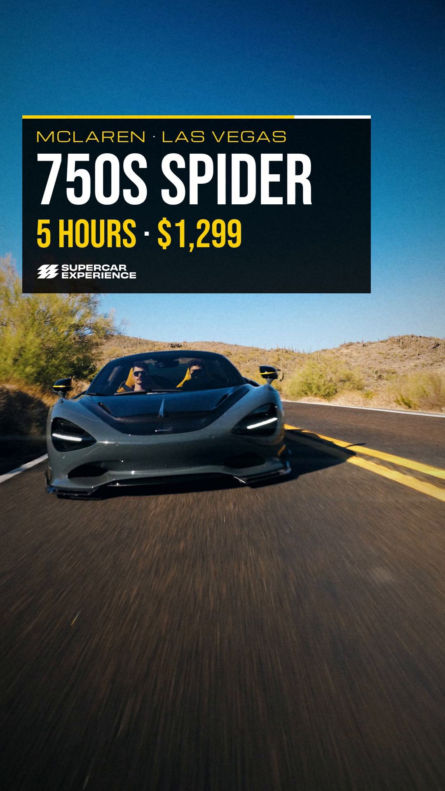
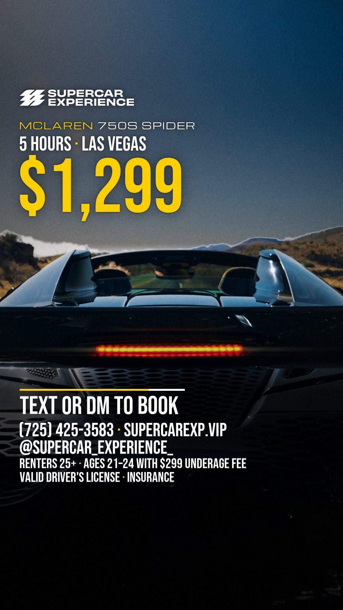

# "ROOF DOWN": McLaren 750S Spider, LOCKED ON, 18 s 9:16 story

**Status: DRAFT for Omarie's review. It is not approved and has not been posted anywhere.** It is built to
THE STANDARD for SE ads (`locked-on`, `../HOUSE-STYLE.md` on the SE branch). It started from the approved GT3
RS showcase's settings and library (`../flash-special-showcase/`, whose `lib/` modules are vendored here).

 

It is an evergreen rental ad for the 2026 McLaren 750S Spider in Las Vegas, cut from SE's own clip of that
car (Dropbox `Supercar Experience/01 Car Footage/SCE_McLaren-750S_no-branding.mov`: "the car in the 750S
Spider reel on the rental listing"). The idea comes from the footage. The clip's last shot is a locked-off
view of the car's tail while the retractable roof stows. There, the giant word SPIDER rises out of the sky
**behind** the car as the roof folds away, the buttresses and rear deck stay in front of it, and then the
price rises from behind the car for the end card.

## On screen, and where each line comes from

| Line | Source |
|---|---|
| MCLAREN · 750S SPIDER · 2026 · EXOTIC | supercarexp.vip/cars/2026-mclaren-750s-spider-las-vegas, read 27 Sept 2026 ("2026 McLaren 750S Spider", listed under Exotic) |
| LAS VEGAS | the same listing is the Las Vegas one. SE also lists a 750S Spider in Scottsdale (Full Day $1,599, no 5-hour rate), and both listings play this same reel. The ad uses the Las Vegas rates and says LAS VEGAS |
| 5 HOURS · $1,299 (hook, slot reel, end card) | same listing: "5-Hour Rental $1,299" |
| FULL DAY · $1,799 | same listing: "Full Day Rental $1,799" |
| YOU NEED · VALID DRIVER'S LICENSE · INSURANCE (requirements panel, 8.0-10.7 s) | supercarexp.vip booking steps: "Must Have a Valid Drivers License", "Must Have Valid Matching Insurance" (the 750S listing adds "Full coverage insurance required"). The on-screen wording is the approved showcase's |
| RENTERS 25+ · AGES 21–24 WITH $299 UNDERAGE FEE (end card only, the site's own wording; review r2 took a bare "25+" off the requirements panel because the site allows 21-24 with a fee) | supercarexp.vip, 27 Sept 2026: "Renter Must Be 25+ (Ages 21–24 With $299 Underage Fee)". Omarie, 26 Sept (rally vlog): include the age requirement as the site words it |
| TEXT OR DM TO BOOK · (725) 425-3583 · SUPERCAREXP.VIP · @SUPERCAR_EXPERIENCE_ | the approved GT3 RS showcase (Omarie, 26 Sept: the site-wide text line on Las Vegas footage, TEXT not CALL, and the handle). The site still shows "Questions? Text Us (725) 425-3583" on 27 Sept |
| SPIDER (giant, behind the car) | the model's name. It is set as the roof stows, which is what makes it a Spider |
| SE lockups | `../../02-logos/png/sce-primary-horizontal--white.png` |

All on-screen copy scores 5/5 CLEAN in SlopMonster (`deslop.py` from the SE branch, run on every line; 68
words). Every figure is in `config.json`, with its source. The ad shows no horsepower, 0-60, top speed, discount,
"save $X", testimonial or countdown. The site's standing promo ("50% Off 2nd Day or 3rd Day Free") is left off
because the approved ads carry no discount unless one is given for the ad. The slot reels only ever show
blurred intermediates, and they land on the true digits.

## Defaults I chose (change any of them and re-render)

These were the open decisions in the brief. Each default follows the newest approved precedent.

| Decision | Default used | Why |
|---|---|---|
| Car | 2026 McLaren 750S Spider | a priority car; its footage is the listing's own reel; it has no LOCKED ON ad yet (the GT3 RS has one) |
| Offer | the site's standing rates: 5 hours $1,299, full day $1,799 | the 26 Sept flash offers are expired and must not be reposted; a new promo needs Omarie's figures |
| City and phone | Las Vegas; the text line (725) 425-3583, TEXT OR DM TO BOOK | the approved LV showcase uses this exact line after fix r2. The 5-hour rate exists only on the LV listing |
| Age line | 25+ with the site's $299 underage-fee wording | Omarie's 26 Sept decision on the rally vlog (newer than the 21+ on the older ads) |
| Music | the clip's own music | house rule 7 and Omarie ("Keep music as well"). **Its rights are not verified: confirm before any paid use** |
| Grade | one day grade across all shots | the standard says "one night grade"; this clip is sunlit desert, and a night look would read fake and break the sky key. The point of the rule (one cohesive look) is kept |
| Delivery | the files are sent to the requester only | nothing is posted and nothing is uploaded to Dropbox without a per-action go |

**Questions for Omarie before this runs:**
1. The footage is Arizona desert (saguaros at 0-1.0 s including the poster frame, 1.5-2.9 s, 7.0-7.5 s and
   8.4-9.8 s), and the ad says LAS VEGAS.
   The site's own Las Vegas listing uses this reel, so the ad makes no false claim. A local viewer may still
   notice. Is that OK? If not, those shots can be swapped for saguaro-free takes from the same clip.
2. Is the clip's music cleared for paid use? It came with SE's footage, but the track is not identified.
3. Should INSURANCE read FULL COVERAGE INSURANCE, to match the listing's wording?

## Sound

The bed is the clip's own music from orig 0.000, with no edit and no time-stretch. The picture is cut to its
130 BPM grid, and the accents sit at 45 % under it (`audio/bed.py`, `audio/bed_sync.json`). **Nobody has
listened to it yet; all audio checks were numeric** (loudness, peaks, band energy, the tape-stop pocket).
Before posting, Omarie should listen on a phone speaker and on headphones, mainly to the drop at 4.73 s, the
tape stop at 13.50 s and the end-card hit at 13.96 s. The master bed is -14.0 LUFS / -2.6 dBTP; the delivered
AAC measures -14.1 LUFS / -2.7 dBTP (`exports/qa/qa_summary.json`).

## Review round 1 (four lenses: claims, brand, legibility, craft; each finding re-checked by a skeptic)

| Finding | Fix |
|---|---|
| Blocking: the vertical whip-outs smeared true figures into readable wrong ones ($1,299 read as $1,200, the expired GT3 RS flash figure; 750S read as 700S) | Figure rows fade out over the 2 frames before every whip exit (`figFade` in `front.html`); the end-card price rises as one word, slower and shorter, at a 180-degree shutter. Every exit frame is now in the QA stills |
| Blocking: the crash hit punched the plate after the sky matte was cut, so SPIDER slid over the car, then snapped back | The crash punch now runs on plate + matted type together (`build.py` composite), easing to 1.0 with no step |
| Blocking: the sun's flare orb keyed as car where it touched the left buttress and cut a disc out of the P | Inside the orb's disc, anything not darker than the sky model is sky (`lib/sky.py`) |
| Blocking: 0.5x and ramped shots blended two frames, so every other frame was a double exposure | Every shot at a non-integer speed now samples 4x optical-flow in-betweens (`lib/dense.py`, one pass per shot) |
| RGB split drew a lime border on the drop frames; the impact's scale floor stepped to 1.0 on one frame | The impact runs on a reflect-padded frame and its floor eases out (`lib/plate.py`); `fx.py` stays identical to the approved copy |
| Badge callout hung over the black gap; its lines held under 1.2 s | The callout exits before the gap; the brackets lock in 5 frames and the lines set earlier (holds 1.2-1.4 s) |
| Headlight brackets half under the offer panel | Clamped to the lamp below the panel |
| Stripe ran through the price's comma; FULL DAY too small | Stripe moved to y 728; FULL DAY · $1,799 in Bebas 60 |
| Requirements panel: 13 words in 1.7 s | Now 7 words (the fee wording stays on the end card) held about 2.6 s, starting on the text-free rear chase |
| End-card gold price and top block on a pale sky (1.5:1) | A sky-only ND behind the top block and the price, a sky chroma lift, and close dark halos under the type |
| The finale read as a different, slate-grey look | The grad ND is lighter (0.28) and the roof shot's sky gets a chroma lift, so it stays blue |
| Light sweep reached the car late and lit the hills | It is gated to the car body below the horizon and runs 13.62-14.05 s |
| Tape stop never fell into a pocket (a sub rumble held to the hit) | 40 Hz high-pass, an 80 ms fade, and the track returns exactly on the hit |
| Nits | The vignette no longer dims the graphics; the end card has the 78/22 stripe; the requirement lines are larger and spaced; the matte band edges are feathered; the source quotes are verbatim |

## Review round 2 (every round-1 finding re-checked on the re-render, plus a fresh-eyes pass)

All round-1 blockers were confirmed fixed (no frame shows a wrong figure; the type stays behind the car
through the crash; the P is whole; the black gap is clean). Round 2 found:

| Finding | Fix |
|---|---|
| Blocking: the new end-card sky ND left a bright rim along the hill ridge and a lighter stripe of sky over the logo | The ND ramps in from above the frame (monotonic sky), fades out at the ridge line, and is gated by a grown matte, so the haze rim darkens with the sky; its chroma is lifted with it, so the held sky stays blue |
| The requirements panel said 25+ with no mention of the site's 21-24 allowance | It now reads YOU NEED / VALID DRIVER'S LICENSE / INSURANCE; the age appears once, in the site's words, on the end card |
| At 1.3x the optical flow melted the car on the hook's approach shot | Beat 2 plays whole source frames at 1.0x (src 261-282) |
| The badge shot's truss strobed (minterpolate blends fast bars, so every other in-between doubled) | Every badge frame averages a whole source frame of in-betweens: an even motion blur, the badge stays sharp |
| The hook softened after frame 0 (bilinear push, 2-sample average) | Pushes use a Lanczos resample (identity at scale 1.0); slow shots take one in-between per frame |
| The end-card comma briefly hid behind the buttress and read as a decimal; SPIDER and the price double-exposed on one frame | SPIDER sinks faster (gone by 13.88 s); the price rises after it, travels less, and fades in over its first frames |
| The instrument cluster read 33-41 MPH next to a posted 25 | The cluster is defocused on the badge shot |
| MCLAREN 750S (behind-car) under 3:1 | A stronger halo; 750S in white |
| Exits left an empty panel for a frame | Every text row fades as its panel starts the whip |
| FULL DAY · $1,799 wiped in glyph by glyph; the figure was white | The label wipes; the figure arrives whole, in gold |
| The requirements panel entered while the offer's whip tail was still on screen | It enters one frame later (8.00 s), at a 28-sample shutter |
| Nits | The drop's eased scale is applied before the pad is cropped (no mirrored edges); the zenith corner keys as sky at low res too; the vignette runs before the behind-car type; the darkest plates (bridge, hands) get a small shadow lift; the whipped stripes now draw on as intended (wrappers) |

## Change a figure

Edit `config.json`, then run `python3 build.py`. Only the layers that changed re-render.

## Re-render

```bash
FOOTAGE=/path/to/folder/with/the/clip python3 build.py   # every stage, cached; ~10 min on 4 CPUs
python3 build.py --frames 0,113,300,431                  # stills -> .work/stills/
python3 build.py --qa                                    # QA on the delivered file -> exports/qa/
```

The clip is `SCE_McLaren-750S_no-branding.mov` from Dropbox `Supercar Experience/01 Car Footage/` (84 MB,
2160x3840 H.264 High 10 at 10-bit, 23.976 fps, 24-bit PCM stereo, 24.36 s). The default footage folder is `.work/footage/`.
The build needs Python 3 with numpy and Pillow, ffmpeg with libx264, and Node 22 with Playwright
(`/opt/node22/lib/node_modules/playwright`).

Stages, each cached in `.work/` (ignored by git):

1. `source`: frame-exact decode to 1080x1920, never with `-ss`.
2. `dense`: 4x optical-flow in-betweens of the roof shot, via `lib/dense.py` (ffmpeg minterpolate).
3. `prep`: the config, timeline and tracks as JS for the pages.
4. `plate`: `lib/plate.py`.
5. `front`: `front.html`.
6. `mid`: `mid.html`.
7. `audio`: `audio/bed.py`.
8. `finish`: composite, then the master and delivery encodes.
9. `qa`.

## Files

| Path | What |
|---|---|
| `config.json` | every figure and claim string, with sources |
| `cue.md` | the build cue as built: beat table, layer stack, graphics positions |
| `front.html` / `mid.html` | the front motion layer / the behind-the-car type layer (`window.renderAt(t)`) |
| `build.py` | the one-command build |
| `lib/edl.py` | the beat table on the music's 130 BPM grid (timing and plate FX, no copy) |
| `lib/plate.py` | the plate: sampling, day grade, streaks, pushes, whips, impacts, leaks, plate blur, grad, light sweep |
| `lib/sky.py` | the sky matte that puts type behind the car (no roto: the shot is locked off against open sky) |
| `lib/dense.py` | optical-flow slow motion for the roof shot |
| `lib/track_npy.py`, `lib/data/tracks.json` | template tracks of the McLaren speedmark on the steering wheel (f204-225) and the headlight (f136-157), via the approved `lib/track.py` |
| `lib/plate_find.py`, `lib/data/plate_track.json` | the licence-plate box on the rear chase shot (f348-368) |
| `audio/bed.py` (+ `bed.wav`, `bed_sync.json`) | the sound bed: the clip's music plus accents, mastered |
| `lib/fx.py`, `kinetic.js`, `lock.js`, `kcapture.js`, `accum.py`, `track.py`, `audio/synth.py` | vendored unchanged from `../flash-special-showcase/` |
| `exports/` | `poster.jpg` (frame 0, the complete hook), `poster-endcard.jpg`, `contact-sheet.jpg`, `qa/` |
